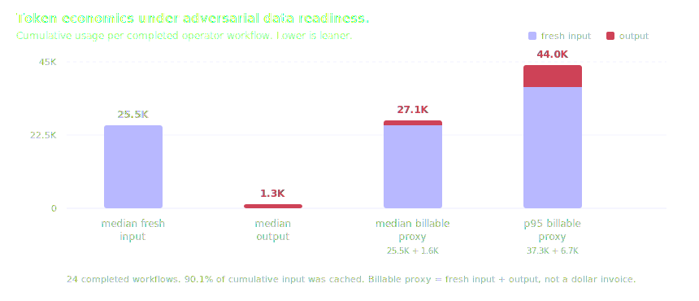
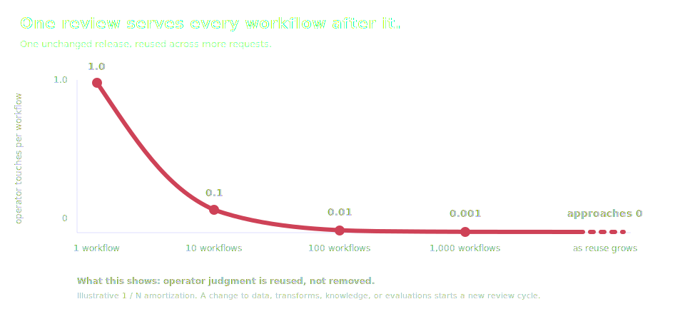
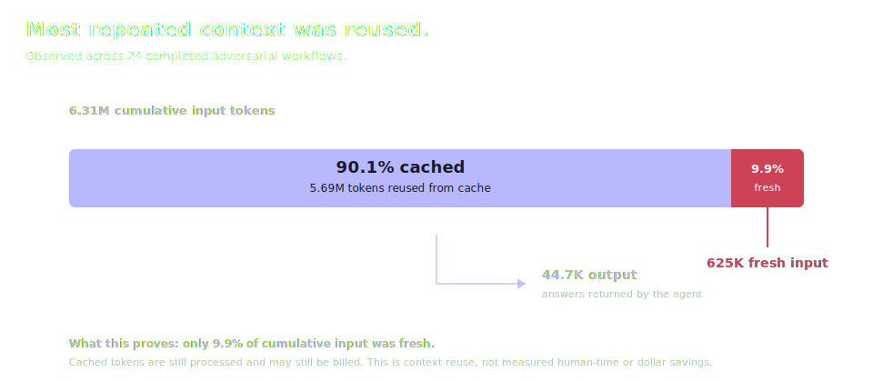

<h1 align="center">procdork</h1>

*It's a dork. "Dorks" or "Google Dorks" refer to advanced search strings used in search engines (like Google) to uncover specific, often unintended information.*

This dork is a harness built to run at the neck break speed of AI, but intended for supply chain workflows. ELT pipelines are ded, cuz data analysts are dead.
Coding agents are as much part of infrastructure as the infrastructure.

## Measured Evidence

### Repeated Answers

Initial tests asked an agent the same two questions again and again. One
question asked for a table. The other asked for a chart. The tests ran from
July 11, 2026 at 3:40 PM Pacific time to July 12, 2026 at 11:41 AM Pacific time.

Across 64 runs, the agent made 192 calls. Every call worked. Every answer found
the same numbers: 5 sessions, 8 messages, 46 events, and 29 cited sources. Every
chart showed the same four points, the same highest value, and the same total of
88.

The agent did not always take the same path. It wrote queries in different ways
and sometimes used slightly different words. A few tables left out the first
and last timestamps. The facts did not change, and no mistake kept happening.

This is the useful kind of consistency: the agent can think differently while
the harness keeps the answer steady.

Two checks remain. The agent carried more background text than it needed, so
that cost should be trimmed. These runs also checked live answers, but not
whether an agent can find and read the knowledge files.

### Adversarial Data Readiness

A second test adversarially challenged the harness. From July 12, 2026 at 5:26
PM to 6:40 PM Pacific time, an operator asked about supplier choices, evidence
gaps, freshness, ingestion health, confidence, conflicts, and delivery
performance. Some transforms were deliberately left stale or without the data
needed to answer.

Across 24 completed workflows, the agent made 313 MCP calls. The median
workflow made 13 calls; the 95th percentile made 28. Twenty-six individual
calls reported errors, but every included workflow still produced a final
answer. When the requested evidence was missing, the harness said what it could
and could not prove. A review of the saved answers found no invented supplier
ranking, delivery score, confidence measure, or conflict result.

The workflows used 6.31 million cumulative input tokens. Of those, 5.69 million
were cached, for a 90.1% cache rate. They used 625,365 fresh input tokens and
44,695 output tokens. The median completed workflow used 25,523 fresh input
tokens, 1,305 output tokens, and a 27,100-token billable proxy. The 95th
percentile billable proxy was 43,995 tokens. Here, billable proxy means fresh
input plus output; it is not a dollar invoice.

The harness stayed inside its deterministic evidence boundaries. That kept the
agent from sliding into made-up answers when the operator-owned transforms were
not ready. This test checks graceful behavior under poor data readiness; it does
not prove accuracy when complete data is available. One interrupted workflow
was excluded. These runs did not time a human baseline or record historical
development hours, so they do not yet support organizational-time-saved or
total-development-time claims.

## The Harness

Modern Snowflake and Databricks already combine ingestion, transformation,
scheduling, governed meaning, and natural-language analytics. The harness does
not claim to invent that operating loop. It asks whether the same jobs can live
in a small repository whose storage, compute, scheduler, knowledge, and client
surface can be replaced independently.

| Concern | Snowflake | Databricks | The harness |
|---|---|---|---|
| Executable business logic | Semantic Views | Metric Views | dbt marts |
| Institutional context | Semantic metadata and instructions | Genie knowledge store and instructions | Versioned OKF knowledge |
| Analytical delivery | Cortex Analyst | Genie Agent | MCP exposed for user agents |
| Query execution | Snowflake warehouse | Databricks SQL warehouse | Replaceable OLAP adapter |
| Client surface | Platform API and applications | Platform API and applications | Any MCP-capable agent |

This mapping matters. OKF does not replace Semantic Views or Metric Views.
Those platform objects define executable calculations, dimensions, joins, and
aggregations. dbt owns that responsibility in the harness. OKF records the
meaning, caveats, provenance, terminology, and interpretation that should travel
with those calculations. MCP then exposes the reviewed data and its knowledge
to user agents.

### 1. The knowledge survives the platform

A Semantic View remains a Snowflake object. A Metric View and Genie Agent
configuration remain Databricks objects. In the harness, transformations are
SQL and dbt, institutional knowledge is Markdown, and delivery uses MCP. These
artifacts remain readable if the storage engine, model, host, or analytical
client changes. The advantage is reversibility: changing infrastructure does
not require throwing away the organization's explanations with it.

### 2. Changes happen in one reviewable place

The transform, its interpretation, its caveats, and its serving behavior live
in one repository. A team can review them through ordinary diffs instead of
coordinating changes across warehouse objects, catalog configuration, agent
instructions, dashboards, and separate administration surfaces. The harness is
lean because it reduces control planes, not because enterprise controls are
useless.

### 3. Meaning and execution stay separate

dbt determines the answer. OKF explains the answer. MCP delivers the answer.
This separation prevents prose from silently becoming calculation logic while
allowing institutional context to evolve without rebuilding the warehouse.
Executable truth remains testable SQL; human context remains readable text.

### 4. User agents keep one stable boundary

User agents connect through MCP. They do not need to know whether a query runs
in DuckDB, MotherDuck, or another analytical engine. Storage and compute can
change behind that boundary without asking every user to adopt another client
or platform-specific agent. The harness owns the changing backend; the user
agent keeps the same analytical surface.

### 5. Structure is earned incrementally

The harness can begin with one reviewed transform and one adjacent knowledge
file. More structure is added when a real analytical need appears, not because
a platform exposes another object type. This keeps early decisions cheap to
reverse and lets repeated use determine what deserves to become durable.

That reviewed work is reusable. If one unchanged release serves one workflow,
it carries one operator touch per workflow. If it serves ten workflows, the
same touch is spread across ten uses: 0.1 per workflow. At one hundred uses it
is 0.01, and at one thousand it is 0.001. This is not measured human time. It
is the simple `1 / N` effect of reusing one reviewed release.

Operator judgment does not disappear. A change to data, transforms, knowledge,
or evaluations starts another review cycle. Between those changes, the same
reviewed surface can serve more workflows without repeating that decision for
every user.

That is the defensible position: Snowflake and Databricks provide the complete
loop as integrated platforms. The harness expresses the same loop through open,
replaceable artifacts. It does not yet prove lower platform cost, faster
delivery, stronger governance, or greater scale.

One kind of reuse has been measured. Across 24 completed adversarial workflows,
90.1% of cumulative input tokens came from cache. That does not mean the tokens
disappeared or were free. It means only 9.9% of cumulative input was fresh.

## References

### Snowflake

* [Dynamic Tables](https://docs.snowflake.com/en/user-guide/dynamic-tables/overview) - declarative, dependency-aware transformation pipelines with managed refresh.
* [Tasks](https://docs.snowflake.com/en/user-guide/tasks-intro) - scheduled and event-triggered workflow execution.
* [Semantic Views](https://docs.snowflake.com/en/user-guide/views-semantic/overview) - database objects for business entities, relationships, dimensions, facts, and metrics.
* [Cortex Analyst](https://docs.snowflake.com/en/user-guide/snowflake-cortex/cortex-analyst) - managed natural-language analytics backed by Semantic Views and generated SQL.

### Databricks

* [Declarative Pipelines](https://docs.databricks.com/aws/en/ldp/) - batch and streaming ingestion and transformation in SQL and Python.
* [Lakeflow Jobs](https://docs.databricks.com/aws/en/jobs/) - scheduling, orchestration, control flow, monitoring, and task execution.
* [Metric Views](https://docs.databricks.com/aws/en/business-semantics/metric-views/) - centrally maintained measures, dimensions, joins, and business definitions in Unity Catalog.
* [Genie Agent concepts](https://docs.databricks.com/aws/en/genie/concepts) - curated datasets, knowledge, instructions, trusted SQL, benchmarks, and natural-language analytical delivery. Genie Agents were formerly called Genie Spaces.
* [Genie Agent curation](https://docs.databricks.com/aws/en/genie/best-practices) - Databricks guidance on focused datasets, structured semantics, example SQL, and incremental refinement.

### Open Knowledge Format

* [OKF specification](https://okf.md/spec/) - the minimal Markdown and YAML convention used for portable organizational knowledge.
* [OKF FAQ](https://okf.md/faq/) - scope, portability, Git workflow, MCP use, and the explicit distinction between OKF and a data catalog.
