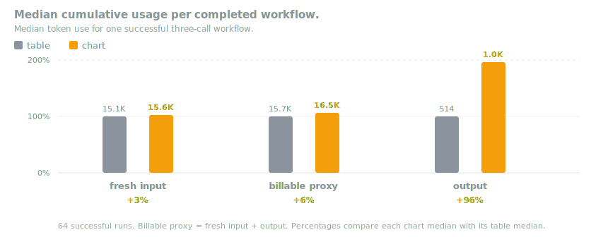

<h1 align="center">procdork</h1>

> [!WARNING]   
> Its a WIP.

*It's a dork. "Dorks" or "Google Dorks" refer to advanced search strings used in search engines (like Google) to uncover specific, often unintended information. What did you think?*

This dork is a harness built to run at the neck break speed of AI, but intended for supply chain workflows. ELT pipelines are ded, cuz data analysts are dead.
Coding agents are as much part of infrastructure as the infrastructure.

## Benchmarks

### Repeated Proof

Initial tests asked an agent the same two questions again and again. One
question asked for a table. The other asked for a chart. The tests ran from
July 11, 2026 at 3:40 PM Pacific time to July 12, 2026 at 11:41 AM Pacific time.

Across 64 runs, the agent made 192 calls. Every call worked. Every answer found
the same numbers: 5 sessions, 8 messages, 46 events, and 29 cited sources. Every
chart showed the same four points, the same highest value, and the same total of
88.

The agent did not always take the same path. It wrote queries in different ways
and sometimes used slightly different words. A few tables left out the first
and last timestamps. The facts did not change, and no mistake kept happening.

This is the useful kind of consistency: the agent can think differently while
the harness keeps the answer steady.

Two checks remain. The agent carried more background text than it needed, so we
should trim that cost. These runs also checked live answers, but not whether an
agent can find and read the knowledge files.

### The load testing lore(s)

TODO

### Charts

TODO
